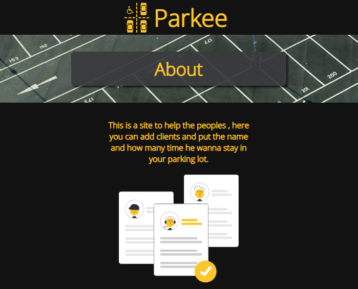
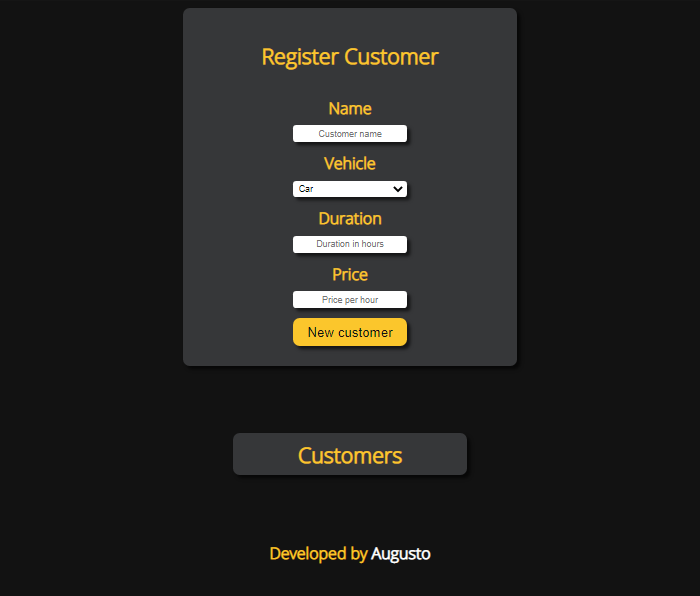
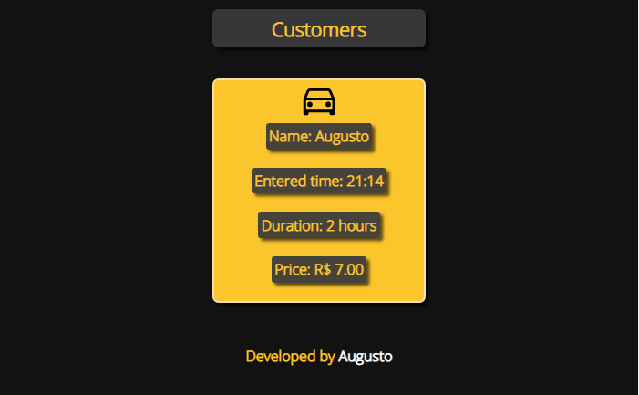
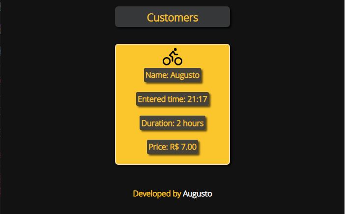

# About (Curstomer-Register) 📑

The project to save the customer (Name, check-in time, duration and the price to pay)

# Data 💾

1. here we have 4 inputs , they are about : Customer name, Vehicle Type , Time you want to stay and the price (The owner 
choose the price per hour)

2. Will be checked if all the inputs have some value, if not will show a alert.

3. After we check a card will be created showing all the informations, the card image change if you choose a car or motorcycle.

4. Observation: The mobile version is not ready you can get this project and prepare the mobile version to use .

# Top preview 🔼

# Bottom preview 🔽

# Customer Car 🚗

# Customer Motorcycle 🏍️

